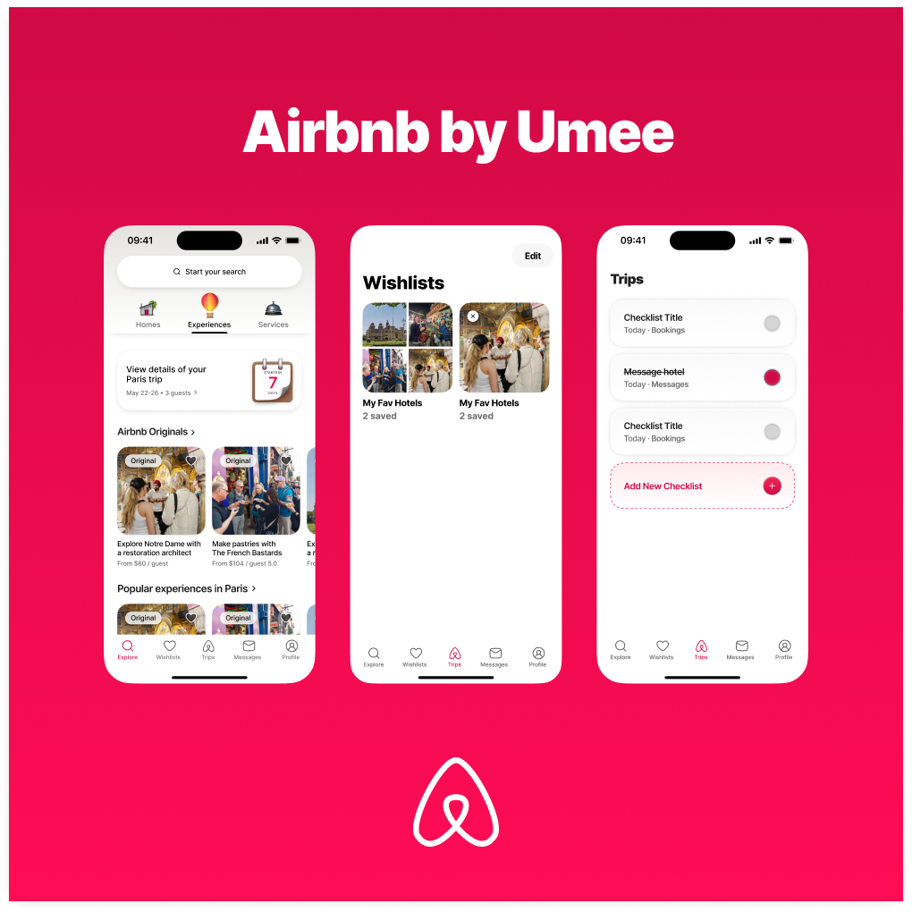
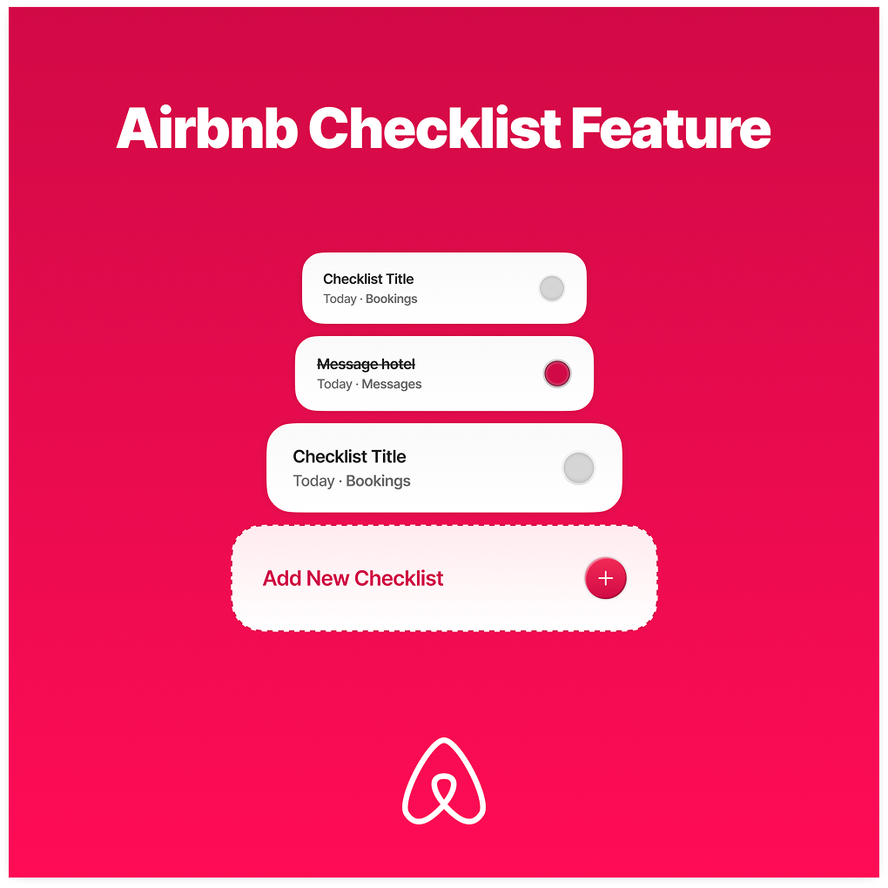
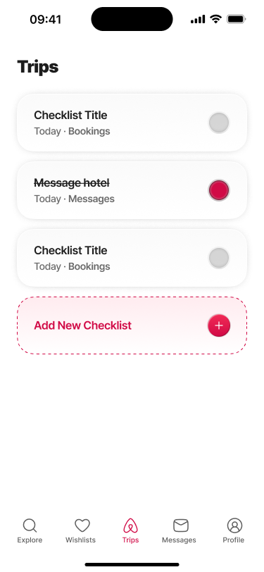

# Reimagining Airbnb — Designed by Umee, Built by Umee


&nbsp;

---

## The Story

One day I opened Airbnb, started scrolling, and couldn't stop noticing things. The way the nav bar fades into a gradient. The spring on the card press. The way every screen feels considered, not just designed. I thought — I want to build that. Not to copy it, but to get close enough to understand how it thinks, and then add something to it in the same voice.

So I opened Figma and started from zero. Every icon drawn by hand. Every color token named with intent. Every spacing decision made before a single component was written. Weeks later, I had a design system. Then I had a codebase that matched it.

This is that project.

> [→ View Figma File](https://www.figma.com/design/sWIdRMMikwCbs8d71Y6gaF/Airbnb-Redesign-by-Umee?node-id=0-1&t=dmc5o5ssNdfKSlhM-1)

---

## The Design System

Everything starts with tokens.

I built the system in layers — primitive values first (raw colors, spacing, type scale), then semantic tokens that give those values meaning (`surface.primary`, `text.muted`, `border.subtle`). Dark and light mode aren't a toggle slapped on at the end — every token maps to both themes from the start, persisted via AsyncStorage so the app remembers your preference.

The icon set is custom SVG, drawn in Figma. The gradient system — navigation bar, card overlays, ambient surfaces — comes from a dedicated token layer too.

The Figma file and the codebase use the same naming. Handoff to yourself is a different kind of discipline.

---

## Where It Stands

### Home / Explore — Done

The home screen was the first real test. Scroll orchestration, gradient nav bar that responds to position, horizontal carousels, listing cards with wishlist interaction, safe area handling across devices. Haptic feedback on the interactions that deserve it.

Getting the motion right took time. Spring physics, not linear easing. It's a small thing that changes how the whole app feels.



&nbsp;

### Trip Planning Checklist — Done

This is the original feature. It lives in the Trips tab and walks users through the early stages of planning a trip — saving a stay, reserving accommodation, reaching out to a host.

The interesting challenge wasn't the checklist logic. It was designing it so it sits inside Airbnb's product without feeling added later. Same type scale, same spacing rhythm, same interaction patterns. It feels like it shipped with the app because it was designed in the same system.

State is persisted via Convex — progress survives app restarts. Animations are coordinated (opacity + translate together). Haptics fire on completion.




---

## Stack

**Design** — Figma (system, components, prototypes, icons)

**Frontend** — React Native, Expo Router, TypeScript, Animated API, Expo Haptics, Expo AV

**Backend** — Convex (real-time, schema-first, queries + mutations)

---

## Structure

```
app/
 ├── explore/
 ├── trips/
 ├── wishlist/
components/
 ├── cards/
 ├── navigation/
 ├── checklists/
hooks/
 ├── useTheme
 ├── useHaptics
convex/
 ├── schema.ts
 ├── queries/
 ├── mutations/
tokens/
 ├── primitives.ts
 ├── semantic.ts
```

---

## What's Next

- Listing detail screen
- Wishlist collections
- Recently viewed history
- Full trip + itinerary object model
- User data persistence

---

## Run It

```bash
git clone <repo-url>
cd project
npm install
npx convex dev
npx expo start
```

---

*Designed and built by Umee*
