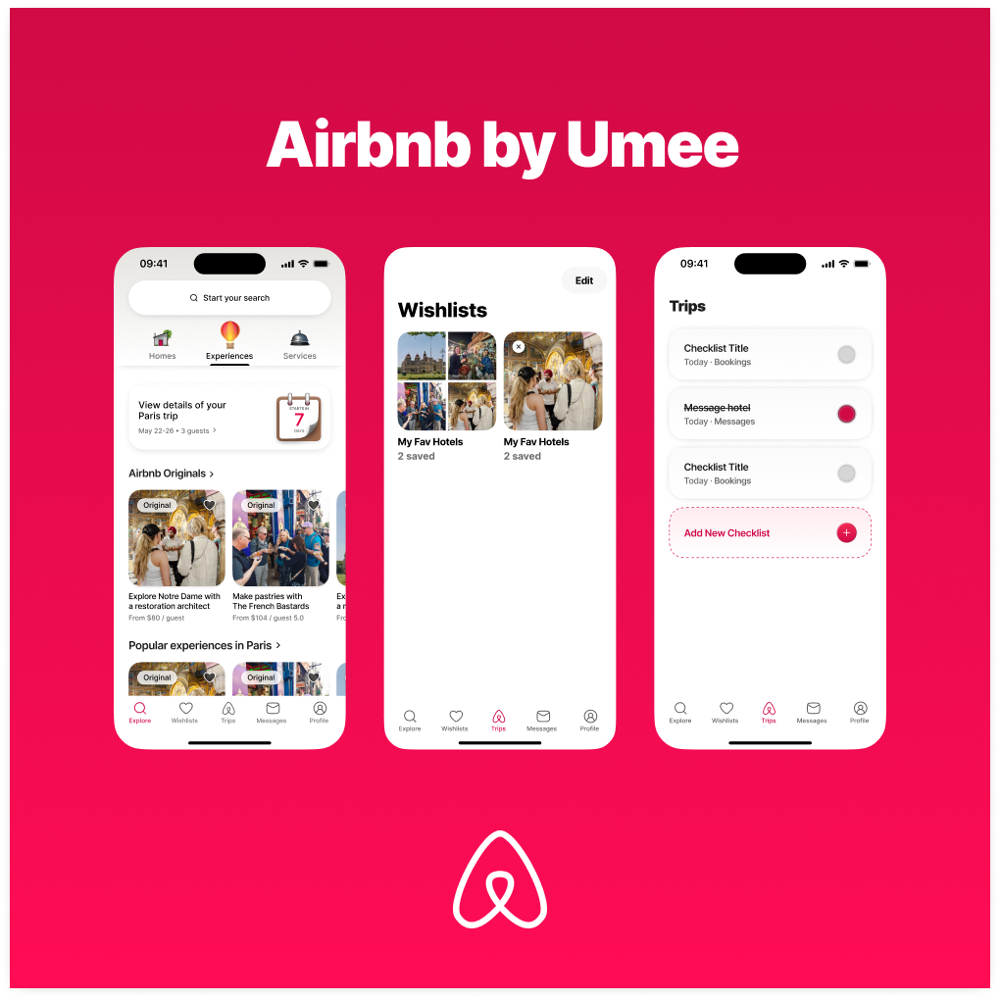
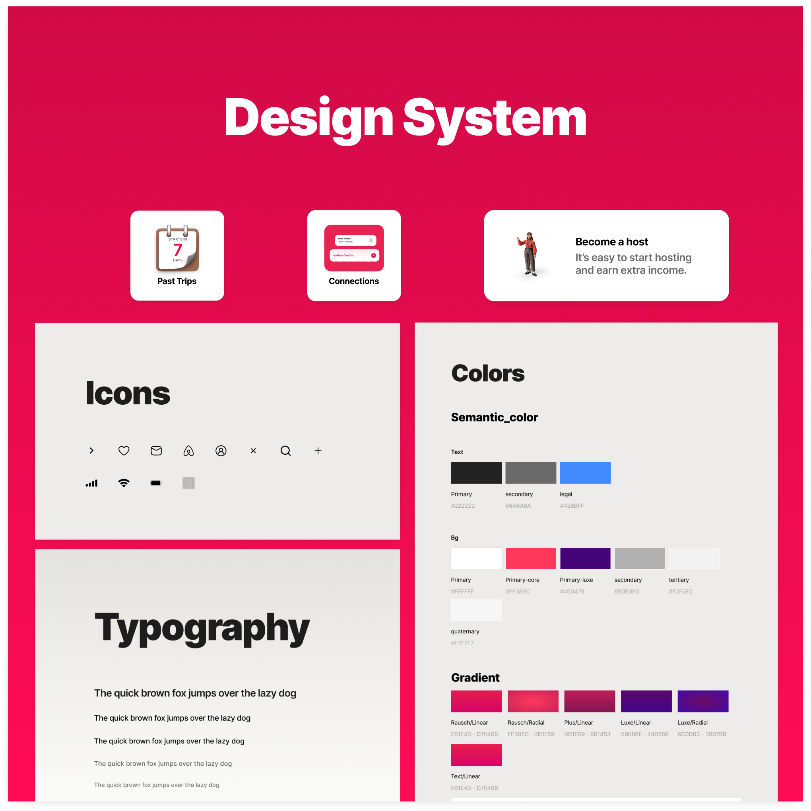
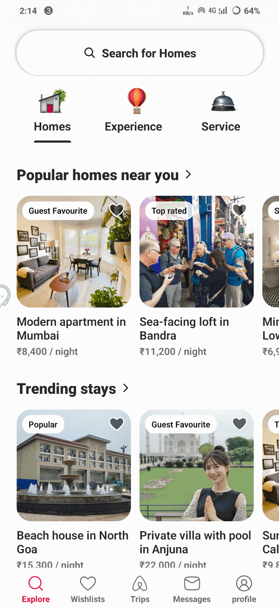
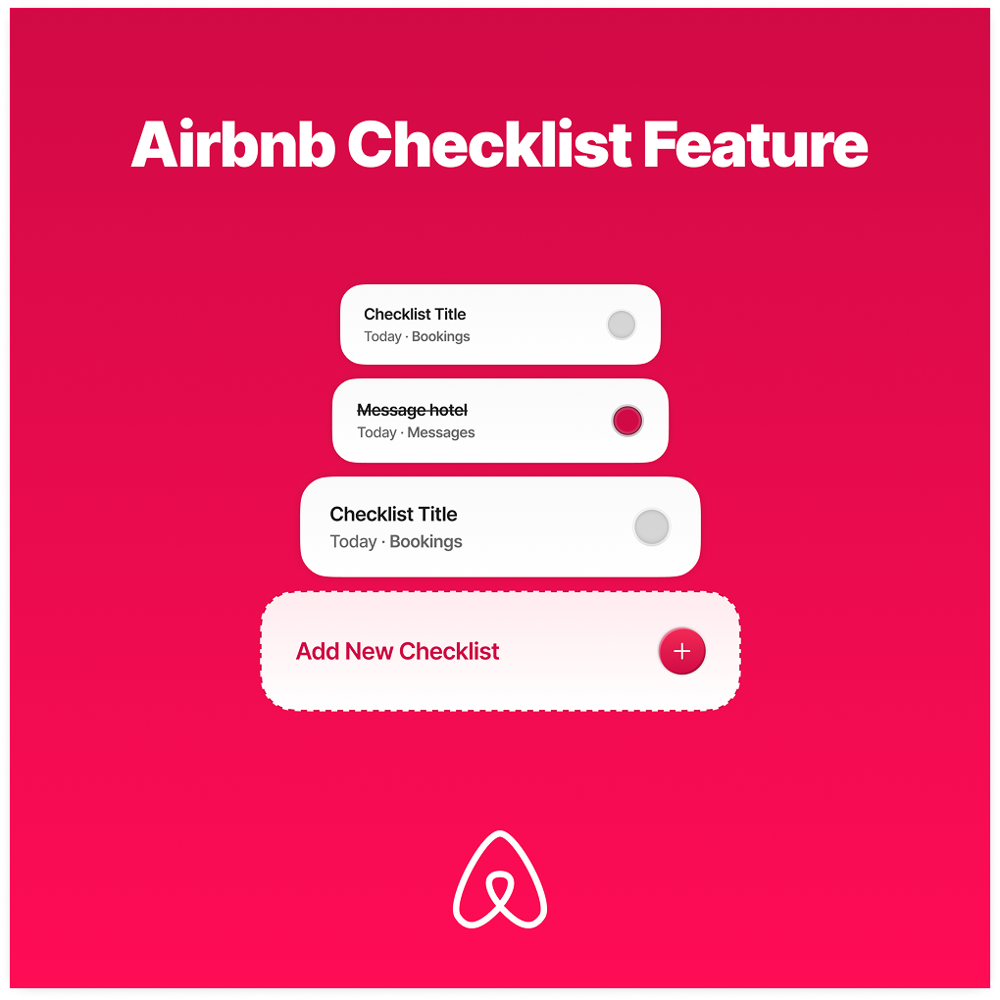
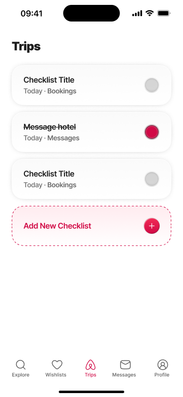
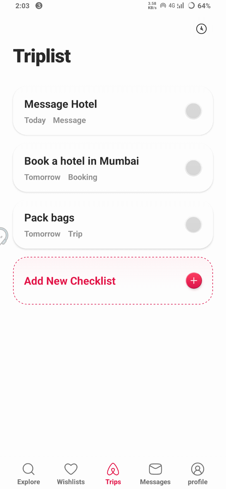
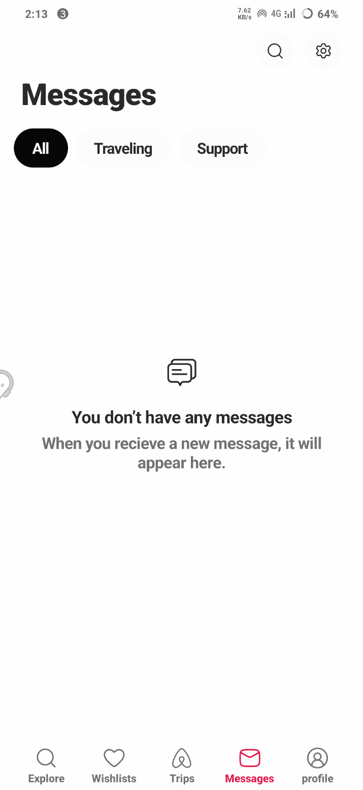
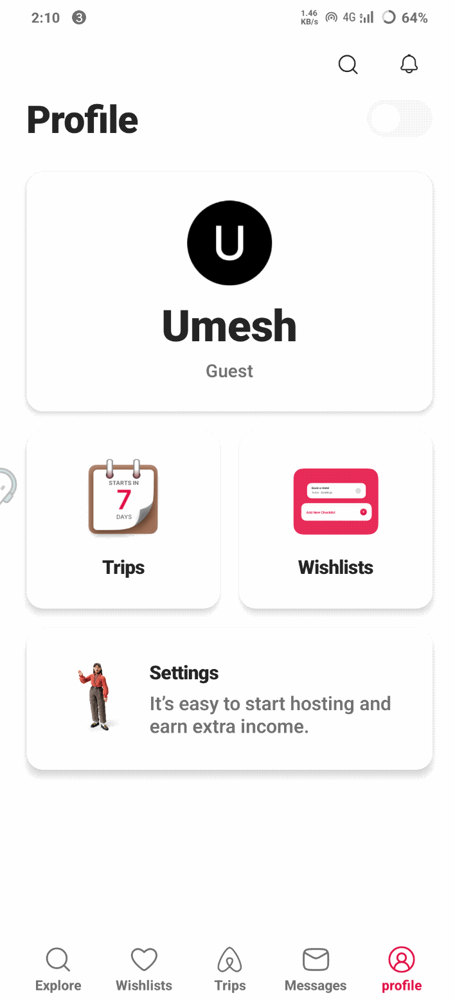

# Reimagining Airbnb, Designed & Built by Umesh

[](https://www.figma.com/design/sWIdRMMikwCbs8d71Y6gaF/Airbnb-Redesign-by-Umee?node-id=0-1&t=dmc5o5ssNdfKSlhM-1)
[](https://expo.dev)
[](https://typescriptlang.org)
[](https://convex.dev)



---

## The Story

One day I opened Airbnb, started scrolling, and couldn't stop noticing things. The way the nav bar fades into a gradient. The spring on the card press. The way every screen feels considered, not just designed.

I thought: I want to build that. Not to copy it, but to get close enough to understand how it thinks, and then ship something new inside it in the same voice.

So I opened Figma and started from zero. Every icon drawn by hand. Every token named with intent. Every spacing decision made before a single component was written. Weeks later I had a design system. Then I had a React Native codebase that matched it exactly.

> [→ View Figma File](https://www.figma.com/design/sWIdRMMikwCbs8d71Y6gaF/Airbnb-Redesign-by-Umee?node-id=0-1&t=dmc5o5ssNdfKSlhM-1)

---

## Why This Project Is Different

Most developers who build React Native apps think in screens. I think in components, because I've spent years designing in Figma at component level. That thinking doesn't switch off when I open Zed. Every hook, every prop structure, every layout decision in this project came from the same instinct I use when building a component library in Figma: make it reusable, make it scalable, make it work in every context without breaking.

That's not a skill I learned from a tutorial. It's just how my brain works now. And it shows in the code.

---

## Tech Stack

| Layer | Tools |
|---|---|
| Design | Figma — full system, components, prototypes, icons |
| Frontend | React Native Expo, Expo Router, TypeScript, Animated API |
| Interaction | Expo Haptics, Expo AV |
| Backend | Convex, real-time, schema-first, queries + mutations |

---

## What's Built

### Design System



Built before a single screen was coded. Primitive tokens (colors, spacing, type scale) mapped to semantic tokens (`surface.primary`, `text.muted`, `border.subtle`). Dark and light mode are token-driven from day one, no hardcoded colors anywhere in the codebase. Theme state persists via AsyncStorage.

The icon set is custom SVG drawn in Figma. The Figma file and the React Native codebase share the same naming system. That kind of parity makes the whole thing easier to maintain and scale.

<!-- drop theme toggle GIF here -->


---

### Home / Explore

Section-based scroll architecture, multiple horizontal carousels, listing card system, wishlist interaction, safe area handling, and recently viewed tracking. Haptic feedback wired to the interactions that deserve it.

Getting the motion right took real effort. Spring physics, not linear easing. It sounds like a minor detail until you feel the difference on a device.


---

### Trip Planning Checklist — Original Feature



A feature I designed and built end to end. Lives inside the Trips tab and guides users through planning a trip: add tasks, mark complete, track progress.

The challenge was not building the checklist. It was making it feel like it always belonged in Airbnb. Same type scale, same spacing, same interaction patterns as the rest of the app. Backend-persisted via Convex so progress survives restarts. Coordinated animations and haptic feedback throughout.

This is what end-to-end feature ownership looks like: designed in Figma, built in React Native, connected to a real backend.



<!-- drop checklist interaction GIF here -->


---

### Wishlist System

Full wishlist collections grid, recently viewed auto-collection, edit mode with deletion, and two card variants: single image and grid preview.

The real work was the architecture underneath it. Instead of local component state, I built a global optimistic UI layer across the app. Likes update instantly before backend confirmation. Explore and Wishlist stay in sync with zero desynchronization. `useWishlist` and `useRecentlyViewed` hooks own all interaction logic. `Card` is a pure UI component, state passed in via props.

This is exactly the kind of component separation that makes React Native codebases maintainable at scale. It came naturally because component-level thinking is already how I approach everything, in Figma and in code.

<!-- drop wishlist GIF here -->


---

### Messages

Full screen built from scratch: action bar, search and settings, filter button group with toggle state, reusable filter components, and a properly designed empty state with custom illustration and token-aware typography.



---

### Profile

Modular `ProfileCard` component supporting vertical and horizontal layouts, optional subtitle, and adjustable image sizing. Theme toggle wired to global state. Proper shadow and elevation parity across Android and iOS. Design tokens used throughout, no one-off styling anywhere.

<!-- drop profile GIF here -->


---

## Architecture

```
app/
 ├── explore/
 ├── trips/
 ├── wishlist/
 ├── messages/
 ├── profile/
 ├── listing/[id].tsx
components/
 ├── cards/
 ├── navigation/
 ├── checklists/
 ├── messages/
 ├── profile/
hooks/
 ├── useTheme
 ├── useWishlist
 ├── useRecentlyViewed
convex/
 ├── schema.ts
 ├── queries/
 ├── mutations/
lib/
 ├── listings.ts
```

Feature isolation throughout. Hooks own domain logic. UI components stay pure. Backend is swappable.

---

## Backend and State

Convex handles real-time data with dedicated schemas for `wishlistItems`, `recentlyViewed`, and `wishlistCollections`. Queries and mutations run live. Optimistic updates apply locally and reconcile asynchronously. The UI never blocks on the network.

Branch-based Git workflow throughout: `trips-checklist-feature`, `wishlist-feature`, `message-feature`, each merged clean into `master`.

---

## What's Next

- Listing detail screen and booking flow
- Full trip and itinerary object model
- User data persistence layer

---

## Run It

```bash
git clone <repo-url>
cd project
npm install
npx convex dev
npx expo start
```

---

*Designed and built by Umee*
